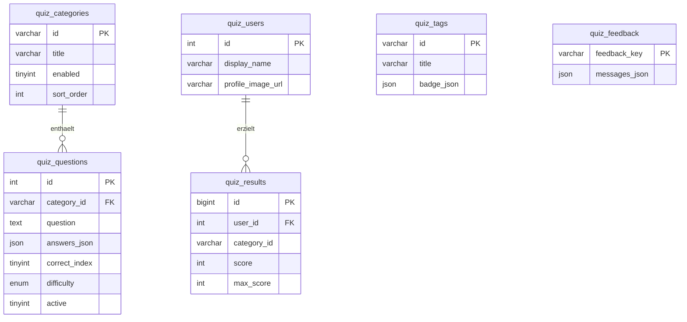

# Quiz-Hero

## Architektur
Quiz-Hero besteht inzwischen aus drei Schichten:

- Frontend: `index.html`, `styles.css` und die Module in `js/`. Das Frontend rendert Quiz, Kategorien, Tags, User-Login und Ergebnisanzeige im Browser.
- Backend/API: `api/index.php` mit `api/bootstrap.php`. Die API liefert Quizdaten aus MySQL, speichert Spieler und Ergebnisse und stellt geschuetzte Admin-Endpunkte bereit.
- Datenbank: MySQL mit Schema in `database/schema.sql`. Gespeichert werden Kategorien, Fragen, Tags, Feedback-Texte, Spieler und Quiz-Ergebnisse.

Der Datenfluss ist bewusst fallback-faehig:

1) Das Frontend fragt zuerst `api/index.php?action=public-data` ab.
2) Wenn die API erreichbar ist, kommen Kategorien, Fragen, Tags und Feedback aus MySQL.
3) Wenn die API nicht erreichbar ist, nutzt das Frontend die alten JSON-Dateien (`categories.json`, `tags.json`, `feedback.json`, `data/questions-*.json`) als Fallback.

Admin-Funktionen laufen nur ueber die PHP-API und MySQL. Die Admin-Session wird serverseitig per PHP-Session verwaltet. Spieler melden sich optional mit Name und Profilbild-URL an; diese Daten und abgeschlossene Ergebnisse werden in MySQL gespeichert.

## Datenbankmodell
Die produktive STRATO-Datenbank ist eine MySQL-Datenbank. Das Schema liegt in `database/schema.sql`. Initiale Quizdaten koennen entweder mit `database/seed-from-json.php` oder fuer phpMyAdmin mit `database/seed.sql` importiert werden.

### Beziehungen


### Tabellenuebersicht
| Tabelle | Zweck | Wird gepflegt durch |
| --- | --- | --- |
| `quiz_categories` | Quiz-Kategorien wie Rom, Neapel, Florenz | Admin, Seed |
| `quiz_questions` | Fragen, Antworten, richtige Antwort, Bild und Wissenstext | Admin, Seed |
| `quiz_tags` | Themenfilter wie Antike, Essen, Kunst | Seed, spaeter Admin-erweiterbar |
| `quiz_feedback` | Rueckmeldungen nach richtigen/falschen Antworten | Seed |
| `quiz_users` | Spielerprofile aus dem optionalen User-Login | Frontend/API |
| `quiz_results` | Gespeicherte Quiz-Ergebnisse pro Spieler | Frontend/API |

### `quiz_categories`
| Spalte | Typ | Bedeutung | Beispiel |
| --- | --- | --- | --- |
| `id` | `VARCHAR(120)` | technische Kategorie-ID, Primaerschluessel | `rom` |
| `title` | `VARCHAR(120)` | sichtbarer Kategoriename | `Rom` |
| `description` | `VARCHAR(255)` | kurzer Untertitel | `Kolosseum, Forum & Co.` |
| `seo_description` | `TEXT` | laengerer SEO-Text fuer Landingpages | `Rom Quiz - ...` |
| `icon` | `VARCHAR(500)` | Bildpfad oder URL fuer Kategorie-Icon | `images/website/kategorie/kategorie-rom-2.png` |
| `enabled` | `TINYINT(1)` | Kategorie aktiv sichtbar | `1` |
| `badge_json` | `JSON` | Badge-Konfiguration | `{"active":true,"text":"Neue Fragen"}` |
| `sort_order` | `INT` | Sortierung in Listen | `20` |
| `created_at` | `TIMESTAMP` | Erstellzeitpunkt | automatisch |
| `updated_at` | `TIMESTAMP` | letzte Aenderung | automatisch |

### `quiz_questions`
| Spalte | Typ | Bedeutung | Beispiel |
| --- | --- | --- | --- |
| `id` | `INT UNSIGNED` | technische Frage-ID, Auto-Increment | `42` |
| `category_id` | `VARCHAR(120)` | Zuordnung zu `quiz_categories.id` | `rom` |
| `question` | `TEXT` | Fragetext | `Welches Bauwerk ist zu sehen?` |
| `answers_json` | `JSON` | vier Antwortoptionen | `["Kolosseum","Pantheon","Forum","Vatikan"]` |
| `correct_index` | `TINYINT UNSIGNED` | Index der richtigen Antwort, 0-basiert | `0` |
| `difficulty` | `ENUM` | Schwierigkeit: `easy`, `medium`, `hero` | `medium` |
| `question_type` | `ENUM` | `text` oder `image` | `image` |
| `image_url` | `VARCHAR(500)` | optionaler Bildpfad oder URL | `/images/italien/rom/rom-kolosseum.png` |
| `tags_json` | `JSON` | Themenzuordnung | `["Antike","Italien"]` |
| `background_knowledge` | `TEXT` | Erklaertext nach Antwort | `Das Kolosseum...` |
| `active` | `TINYINT(1)` | Frage aktiv spielbar | `1` |
| `sort_order` | `INT` | Reihenfolge innerhalb Kategorie | `10` |
| `created_at` | `TIMESTAMP` | Erstellzeitpunkt | automatisch |
| `updated_at` | `TIMESTAMP` | letzte Aenderung | automatisch |

### `quiz_tags`
| Spalte | Typ | Bedeutung | Beispiel |
| --- | --- | --- | --- |
| `id` | `VARCHAR(120)` | technische Tag-ID | `Antike` |
| `title` | `VARCHAR(120)` | sichtbarer Tag-Name | `Antike` |
| `description` | `VARCHAR(255)` | Kurzbeschreibung | `Antike Bauwerke und Geschichte` |
| `icon` | `VARCHAR(500)` | Bildpfad fuer Tag-Icon | `images/website/tag/tag-antike.png` |
| `badge_json` | `JSON` | Badge-Konfiguration | `{"active":false,"text":"Neu"}` |
| `sort_order` | `INT` | Sortierung | `30` |

### `quiz_feedback`
| Spalte | Typ | Bedeutung | Beispiel |
| --- | --- | --- | --- |
| `feedback_key` | `VARCHAR(80)` | Art der Rueckmeldung | `correctFirstTry` |
| `messages_json` | `JSON` | Liste moeglicher Texte | `["Super!","Klasse gemacht!"]` |

### `quiz_users`
| Spalte | Typ | Bedeutung | Beispiel |
| --- | --- | --- | --- |
| `id` | `INT UNSIGNED` | technische User-ID, Auto-Increment | `1` |
| `display_name` | `VARCHAR(80)` | vom Spieler eingegebener Name | `Matze` |
| `profile_image_url` | `VARCHAR(500)` | optionale Profilbild-URL | `https://.../avatar.jpg` |
| `last_seen_at` | `DATETIME` | letzter Login/Zeitpunkt | `2026-06-27 12:30:00` |
| `created_at` | `TIMESTAMP` | Erstellzeitpunkt | automatisch |

### `quiz_results`
| Spalte | Typ | Bedeutung | Beispiel |
| --- | --- | --- | --- |
| `id` | `BIGINT UNSIGNED` | technische Ergebnis-ID, Auto-Increment | `1` |
| `user_id` | `INT UNSIGNED` | Zuordnung zu `quiz_users.id` | `1` |
| `category_id` | `VARCHAR(120)` | gespielte Kategorie, optional | `rom` |
| `tag_id` | `VARCHAR(120)` | gespielter Tag-Filter, optional | `Antike` |
| `score` | `INT UNSIGNED` | erreichte Punkte | `18` |
| `max_score` | `INT UNSIGNED` | maximal moegliche Punkte | `25` |
| `solved` | `INT UNSIGNED` | richtig geloeste Fragen | `8` |
| `total_questions` | `INT UNSIGNED` | Anzahl gestellter Fragen | `10` |
| `created_at` | `TIMESTAMP` | Ergebniszeitpunkt | automatisch |

### Hinweise zu JSON-Spalten
Einige Felder werden bewusst als JSON gespeichert, weil sie strukturierte Listen oder kleine Konfigurationsobjekte enthalten:

- `answers_json`: Antwortoptionen einer Frage.
- `tags_json`: Tags einer Frage.
- `badge_json`: Badge-Anzeige fuer Kategorie oder Tag.
- `messages_json`: mehrere Feedback-Texte pro Feedback-Typ.

Die API dekodiert diese Felder serverseitig und liefert sie dem Frontend als normale Arrays/Objekte.

## Deployment: Produktivumgebung aktualisieren
Der produktive Betrieb braucht einen Webserver mit PHP 8.x, aktivem `pdo_mysql`/`mbstring`, eine MySQL-Datenbank und Zugriff auf die Projektdateien. Docker ist lokal praktisch, aber fuer Produktion optional. Wenn dein Hosting Docker unterstuetzt, kannst du die Compose-Struktur adaptieren; bei klassischem Webhosting laedst du die Dateien hoch und konfigurierst PHP/MySQL dort.

### 1) Vor dem Deploy lokal pruefen
1) Docker-Stack starten und Datenbank pruefen:
```bash
docker compose up -d --build
docker compose run --rm seed
```
2) Lokal testen:
- `http://localhost:8080/`
- `http://localhost:8080/admin/`
- `http://localhost:8080/api/index.php?action=public-data`
3) PHP/JS grob pruefen:
```bash
docker compose exec app php -l api/bootstrap.php
docker compose exec app php -l api/index.php
docker compose exec app php -l database/seed-from-json.php
node --check js/admin.js
node --check js/quiz-data-service.js
node --check js/user-service.js
node --check js/quiz-controller.js
node --check js/quiz-view.js
```

### 2) Cache-Buster und SEO-Seiten aktualisieren
Bei manuellem Deploy ohne GitHub Actions:
1) Cache-Buster/Version anpassen:
   - `index.html` bei CSS/JS/Fonts mit `?v=...`
   - `admin/index.html` bei `js/admin.js?v=...`
   - `js/config.js` (`ASSET_VERSION`)
   - `scripts/build-seo-pages.js` CSS-Version fuer Landingpages
2) Alternativ lokal automatisiert eine Version setzen:
```bash
node scripts/apply-asset-version.js <version>
```
3) SEO-Build mit deiner echten Domain ausfuehren:
```bat
.\scripts\build-seo.bat "https://quiz-hero.de"
```

Bei GitHub-Actions-Deploy wird die Asset-Version automatisch im temporären Deploy-Verzeichnis gesetzt. Verwendet wird der kurze Commit-Hash, z. B. `?v=320c1dd1`. Dadurch bekommen Browser nach jedem Deployment neue URLs fuer CSS, JS, Fonts und JSON-Fallbacks.

### 3) Produktive Datenbank vorbereiten
1) MySQL-Datenbank und eigenen MySQL-Benutzer anlegen.
2) Schema importieren:
```bash
mysql -u <user> -p <database> < database/schema.sql
```
3) Nur bei Erstbefuellung oder bewusstem Reset die bestehenden JSON-Inhalte importieren:
```bash
QUIZ_HERO_DB_HOST=<host> QUIZ_HERO_DB_NAME=<database> QUIZ_HERO_DB_USER=<user> QUIZ_HERO_DB_PASSWORD=<password> php database/seed-from-json.php
```

Wichtig: Das Seed-Script loescht und ersetzt Fragen pro Kategorie aus den JSON-Dateien. Wenn du produktiv bereits Fragen ueber die Admin-Oberflaeche gepflegt hast, fuehre den Seed nicht unbedacht erneut aus.

Bei Hosting ohne Shell-Zugriff kann stattdessen eine SQL-Datei fuer phpMyAdmin erzeugt werden:

```bash
node scripts/build-seed-sql.js
```

Danach in phpMyAdmin importieren:

1) `database/schema.sql`
2) `database/seed.sql`

`database/seed.sql` befuellt Kategorien, Fragen, Tags und Feedback. User und Ergebnisse werden nicht befuellt.

### 4) PHP-Umgebung produktiv konfigurieren
Setze auf dem Server mindestens diese Umgebungsvariablen:

- `QUIZ_HERO_DB_HOST`
- `QUIZ_HERO_DB_PORT`
- `QUIZ_HERO_DB_NAME`
- `QUIZ_HERO_DB_USER`
- `QUIZ_HERO_DB_PASSWORD`
- `QUIZ_HERO_ADMIN_USER`
- `QUIZ_HERO_ADMIN_PASSWORD_HASH`
- `QUIZ_HERO_USER_TOKEN_SECRET` empfohlen fuer signierte User-Tokens

Fuer Produktion sollte kein Klartext-Admin-Passwort genutzt werden. Hash lokal erzeugen:
```bash
php -r "echo password_hash('DEIN_STARKES_PASSWORT', PASSWORD_DEFAULT), PHP_EOL;"
```

Den erzeugten Wert als `QUIZ_HERO_ADMIN_PASSWORD_HASH` setzen. `QUIZ_HERO_ADMIN_PASSWORD` ist nur fuer lokale Tests gedacht.

`QUIZ_HERO_USER_TOKEN_SECRET` sollte ein langer zufaelliger Wert sein. Die App nutzt ihn, um User-Tokens zu signieren. Dadurch koennen Quiz-Ergebnisse nicht einfach mit beliebigen fremden User-IDs gespeichert werden. Wenn das Secret fehlt, nutzt die App einen vorhandenen Admin-/Datenbank-Secret als Fallback; ein eigenes Secret ist trotzdem sauberer.

Bei STRATO Shared Hosting sind echte PHP-Umgebungsvariablen oft unpraktisch. Deshalb unterstuetzt die App zusaetzlich `api/config.local.php`. Diese Datei ist in `.gitignore` ausgeschlossen und wird in der GitHub-Actions-Pipeline aus Secrets erzeugt.

Beispielstruktur siehe `api/config.local.example.php`.

### 5) Dateien hochladen
Fuer die produktiv laufende Webseite muessen diese Web-Dateien hochgeladen werden:

- `index.html`, `styles.css`, `.htaccess`, `404.html`
- `admin/`
- `api/`
- `content/`
- `data/` und die JSON-Dateien als Fallback
- `fonts/`
- `images/`
- `js/`
- `pages/`
- `categories.json`, `tags.json`, `feedback.json`
- `sitemap.xml`, `robots.txt`

Diese Dateien werden von der GitHub-Actions-Pipeline automatisch nach STRATO in `/html/quiz-hero.de/` deployed. Zusaetzlich erzeugt die Pipeline im Deploy-Verzeichnis `api/config.local.php` aus GitHub Secrets. Diese Datei enthaelt die produktiven Datenbank- und Admin-Zugangsdaten und liegt deshalb nicht im Repository.

Nicht von der Pipeline deployed und nicht fuer den normalen Webbetrieb notwendig:

- `database/`: Schema, Seed-Script und `seed.sql` fuer lokales Setup oder phpMyAdmin-Import
- `scripts/`: Build-/Hilfsscripte; sie laufen lokal oder in GitHub Actions, muessen aber nicht oeffentlich erreichbar sein
- `.github/`: GitHub-Actions-Konfiguration
- `Dockerfile`, `docker-compose.yml`, `.env.example`: lokale Docker-Entwicklung
- `Readme.md`: Projektdokumentation
- `chatGPTAgents/`: Arbeits- und Prompt-Regeln fuer die Content-Erstellung

Nicht produktiv hochladen oder nicht oeffentlich ausliefern:

- `.env`
- `.docker-cli/`
- lokale Backups/Dumps
- persoenliche Notizen wie `hinweise.md`, falls sie nicht bewusst Teil des Deployments sein sollen

### 6) Nach dem Deploy pruefen
1) Seiten pruefen:
   - `https://quiz-hero.de/`
   - `https://quiz-hero.de/index.html`
   - `https://quiz-hero.de/admin/`
   - `https://quiz-hero.de/api/index.php?action=public-data`
   - `https://quiz-hero.de/pages/index.html`
   - `https://quiz-hero.de/pages/rom.html`
2) Admin-Login pruefen und eine Testfrage anlegen/bearbeiten.
3) Quiz mit Testspieler abschliessen und kontrollieren, ob ein Ergebnis gespeichert wird.
4) Server-Logs auf PHP-/Datenbankfehler pruefen.
5) Optional: Sitemap in Google Search Console erneut einreichen.

### 7) Rollback
Vor jedem produktiven Update ein Backup der Datenbank erstellen. Fuer ein Rollback brauchst du:

- den vorherigen Dateistand
- einen Datenbank-Dump vor Schema-/Content-Aenderungen
- die vorherigen produktiven Umgebungsvariablen

## GitHub Actions Deployment zu STRATO
Die Pipeline liegt in `.github/workflows/deploy-strato.yml` und wird bewusst manuell gestartet. Damit geht nicht jeder Commit automatisch live.

### GitHub Secrets anlegen
In GitHub:

1) Repository oeffnen.
2) `Settings` anklicken.
3) `Secrets and variables` -> `Actions` oeffnen.
4) `New repository secret` anklicken.
5) Namen exakt wie unten eintragen und den jeweiligen Wert speichern.

Benötigte Secrets:

- `SITE_URL`: `https://quiz-hero.de`
- `STRATO_SFTP_HOST`: `ssh.strato.de`
- `STRATO_SFTP_USER`: dein STRATO-SFTP-Benutzer, z. B. `developerMatze@yuchingchao.com`
- `STRATO_SFTP_PASSWORD`: dein STRATO-SFTP-Passwort
- `STRATO_TARGET_PATH`: `/html/quiz-hero.de/`
- `QUIZ_HERO_DB_HOST`: STRATO-MySQL-Host
- `QUIZ_HERO_DB_PORT`: meistens `3306`
- `QUIZ_HERO_DB_NAME`: STRATO-Datenbankname
- `QUIZ_HERO_DB_USER`: STRATO-Datenbankbenutzer
- `QUIZ_HERO_DB_PASSWORD`: STRATO-Datenbankpasswort
- `QUIZ_HERO_ADMIN_USER`: produktiver Admin-User
- `QUIZ_HERO_ADMIN_PASSWORD_HASH`: Passwort-Hash, nicht Klartext
- `QUIZ_HERO_USER_TOKEN_SECRET`: langer zufaelliger Secret fuer signierte User-Tokens

Admin-Passwort-Hash lokal erzeugen:

```bash
php -r "echo password_hash('DEIN_STARKES_PASSWORT', PASSWORD_DEFAULT), PHP_EOL;"
```

### Deployment starten
In GitHub:

1) Repository oeffnen.
2) `Actions` anklicken.
3) Workflow `Deploy to STRATO` auswaehlen.
4) `Run workflow` anklicken.
5) Nach Abschluss pruefen:
   - `https://quiz-hero.de/`
   - `https://quiz-hero.de/admin/`
   - `https://quiz-hero.de/api/index.php?action=public-data`

Die Pipeline laedt nur produktive Web-Dateien hoch: Frontend, Admin, API, Content, Bilder, Fonts, JSON-Fallbacks und SEO-Seiten. Nicht hochgeladen werden Docker-Dateien, GitHub-Workflow-Dateien, lokale `.env`, README, `database/`, `scripts/`, `chatGPTAgents/` und persoenliche Notizen.

### Welche Aenderung braucht welchen Deploy?
Fuer normale Datei-Aenderungen gibt es keinen Unterschied im Ablauf: Aenderung committen, zu GitHub pushen und danach den Workflow `Deploy to STRATO` manuell starten. Die Pipeline baut ein neues Deploy-Verzeichnis und laedt die produktiven Web-Dateien komplett nach STRATO hoch.

Typischer Ablauf:

```bash
git status
git add <geaenderte-dateien>
git commit -m "Kurze Beschreibung"
git push
```

Danach in GitHub:

1) `Actions` oeffnen.
2) `Deploy to STRATO` auswaehlen.
3) `Run workflow` starten.
4) Nach erfolgreichem Lauf `https://quiz-hero.de/`, `/admin/` und die API pruefen.

| Aenderung | Deploy-Ablauf | Besonderheit |
| --- | --- | --- |
| HTML, PHP/API, Admin, CSS, JS | Commit, Push, GitHub-Actions-Deploy | Asset-Version wird automatisch gesetzt, damit Browser neue CSS-/JS-Dateien laden |
| Bilder oder Fonts | Commit, Push, GitHub-Actions-Deploy | Pfade in JSON/DB/HTML muessen auf die neuen Dateien zeigen |
| `content/` wie Impressum, Datenschutz, Cookie-Text | Commit, Push, GitHub-Actions-Deploy | Wird als Web-Datei deployed |
| JSON-Fallbacks `categories.json`, `tags.json`, `feedback.json`, `data/*.json` | Commit, Push, GitHub-Actions-Deploy | Relevant fuer Fallback, Seed und SEO-Build |
| SEO-Seiten in `pages/`, `sitemap.xml`, `robots.txt` | Commit, Push, GitHub-Actions-Deploy | Die Pipeline baut SEO-Seiten vorher mit `SITE_URL=https://quiz-hero.de` neu |
| Neue Fragen/Kategorien ueber Admin | Kein Code-Deploy noetig | Daten landen direkt in MySQL; fuer SEO/Fallback bei Bedarf zusaetzlich JSON aktualisieren |
| Datenbankschema `database/schema.sql` | Nicht automatisch deployed/migriert | Schema-Aenderungen bewusst manuell in phpMyAdmin/MySQL einspielen und vorher Backup machen |
| GitHub Secrets, DB-Zugang, Admin-Passwort | Kein Code-Deploy noetig, aber Workflow neu starten | `api/config.local.php` wird beim Deploy neu aus Secrets erzeugt |

Wichtig: Die Pipeline synchronisiert Dateien per SFTP, fuehrt aber keine Datenbankmigration aus. Alles, was in MySQL liegt, bleibt beim Code-Deploy erhalten. Deshalb vor Schema-Aenderungen oder Seed-Imports immer ein Datenbank-Backup erstellen.

## Neuer Content (Kategorien/Fragen)
Der normale Pflegeweg ist jetzt die Admin-Oberflaeche unter `/admin/`. Dort kannst du Kategorien und Fragen anlegen, bearbeiten, aktivieren/deaktivieren und speichern. Diese Inhalte landen direkt in MySQL und werden vom Quiz bevorzugt aus der Datenbank geladen.

Die JSON-Dateien bleiben wichtig fuer:

- initiales Befuellen per `database/seed-from-json.php`
- statischen Fallback, falls die API nicht erreichbar ist
- SEO-Seiten, solange der SEO-Build noch aus den JSON-Dateien generiert

Wenn du neue Inhalte produktiv ueber Admin pflegst, denke daran: Der aktuelle SEO-Generator liest weiterhin `categories.json` und `data/questions-*.json`. Fuer SEO-Landingpages muessen wichtige neue Kategorien/Fragen deshalb entweder auch in den JSON-Dateien gepflegt werden oder der Generator spaeter auf die Datenbank umgestellt werden.

Klassischer JSON-Weg:

1) `categories.json` erweitern:
   - `id`, `title`, `description`, `icon`, `questionsFile`
   - optional: `seoDescription`, `badge`
2) Neue Fragen-Datei anlegen: `data/questions-<id>.json`
   - Felder: `question`, `answers[]`, `correct`
   - optional: `difficulty` (`easy|medium|hero`), `tag[]`, `imageUrl`
3) Bilder in `images/` ablegen und Pfade pruefen.
4) SEO-Build ausfuehren (siehe oben).

## Projektstruktur (kurz)
- `index.html` App-Einstieg
- `admin/` Admin-Oberflaeche fuer Kategorien und Fragen
- `api/` PHP-API fuer Quizdaten, User, Ergebnisse und Admin-Aktionen
- `database/schema.sql` MySQL-Schema
- `database/seed-from-json.php` Import bestehender JSON-Inhalte in MySQL
- `database/seed.sql` generierter SQL-Import fuer phpMyAdmin
- `styles.css` globale Styles
- `js/` Logik (Controller/State/View, DataService, Config)
- `data/` Fragen-Dateien pro Kategorie
- `categories.json` Kategorien-Manifest
- `tags.json` Tag-Metadaten
- `pages/` generierte SEO-Landingpages
- `content/` Modal-Inhalte (Impressum/Datenschutz/Cookies)
- `scripts/build-seo-pages.js` SEO-Generator
- `scripts/build-seo.bat` Build-Wrapper
- `scripts/apply-asset-version.js` setzt Cache-Busting-Versionen fuer Deployments
- `scripts/build-seed-sql.js` erzeugt `database/seed.sql` aus den JSON-Dateien
- `.htaccess` Redirects + Kompression + 404
- `404.html` einfache Fehlerseite mit Footer-Modalen
- `Dockerfile`, `docker-compose.yml`, `.env.example` lokale Docker-Umgebung mit PHP/Apache und MySQL

## App-Logik (JS)
- `js/config.js` Konfiguration (URLs, Labels, Punktelogik, Selektoren, `ASSET_VERSION`)
- `js/quiz-data-service.js` Laedt Kategorien/Fragen, validiert JSON, Cache-Busting
- `js/quiz-state.js` Zustand (Kategorie/Tag, Sequenz, Score, Attempts)
- `js/quiz-view.js` DOM/Rendering/Events
- `js/quiz-controller.js` Nutzerfluss (Auswahl, Antworten, Ergebnis)
- `js/user-service.js` User-Login und Ergebnis-Speicherung ueber die API
- `js/admin.js` Admin-Frontend fuer die API
- `js/main.js` Bootstrap

## SEO-Setup (Landingpages)
- Statische Seiten unter `pages/` (Layout wie Startseite)
- Alle Fragen + Antworten sichtbar (einklappbar)
- FAQPage JSON-LD fuer sichtbare Q/A
- Breadcrumbs sichtbar + BreadcrumbList JSON-LD
- OpenGraph/Twitter-Bilder pro Kategorie
- "Auch interessant" (3 verwandte Kategorien via Tag-Ueberschneidung)
- SEO-Fliesstext aus `categories.json` (`seoDescription`)
- Allgemeiner Info-Block zu Punkte-System/KI-Bildern/Projekt
- Start per `index.html?category=<id>`
- `sitemap.xml`/`robots.txt` werden beim Build erzeugt (nur mit `SITE_URL`)

### URL-Struktur der SEO-Seiten
Die SEO-Seiten sind statische Landingpages im Ordner `pages/`. Sie sind nicht der eigentliche Quiz-Flow, sondern indexierbare Inhaltsseiten fuer Suchmaschinen und direkte Einstiege.

| Seite | Lokale Datei | Produktive URL | Zweck |
| --- | --- | --- | --- |
| SEO-Kategorienuebersicht | `pages/index.html` | `https://quiz-hero.de/pages/index.html` | Uebersicht aller SEO-Landingpages |
| Kategorie-Landingpage | `pages/<kategorie-id>.html` | `https://quiz-hero.de/pages/<kategorie-id>.html` | SEO-Seite fuer eine Kategorie |
| Rom-Beispiel | `pages/rom.html` | `https://quiz-hero.de/pages/rom.html` | Landingpage fuer das Rom-Quiz |
| Florenz-Beispiel | `pages/florenz.html` | `https://quiz-hero.de/pages/florenz.html` | Landingpage fuer das Florenz-Quiz |
| Neapel-Beispiel | `pages/neapel.html` | `https://quiz-hero.de/pages/neapel.html` | Landingpage fuer das Neapel-Quiz |

Die Kategorie-ID kommt aktuell aus `categories.json`, Feld `id`. Der Generator baut daraus den Dateinamen:

```text
categories.json: { "id": "rom", ... }
SEO-Datei: pages/rom.html
Produktive URL: https://quiz-hero.de/pages/rom.html
Quiz-Start aus der Landingpage: https://quiz-hero.de/index.html?category=rom
```

Wichtig: Der spielbare Quiz-Einstieg bleibt weiterhin die Haupt-App unter `https://quiz-hero.de/`. Die Landingpages dienen vor allem SEO, Orientierung und Einstieg in eine Kategorie.

### Aktueller SEO-Datenfluss
Der SEO-Generator `scripts/build-seo-pages.js` liest aktuell aus Dateien:

1) `categories.json` fuer Kategorien, Titel, Beschreibung, Icon und SEO-Text.
2) `data/questions-*.json` fuer Fragen, Antworten, richtige Antwort und FAQPage JSON-LD.
3) `tags.json` fuer thematische Verknuepfungen und "Auch interessant".
4) `SITE_URL` fuer Canonical-URLs, Sitemap und Robots.

Beim GitHub-Actions-Deploy wird der Generator automatisch mit `SITE_URL=https://quiz-hero.de` ausgefuehrt. Danach werden die erzeugten Dateien in `pages/`, `sitemap.xml` und `robots.txt` deployed.

### Langfristiges Ziel: SEO-Generator auf MySQL umstellen
Langfristig sollte der SEO-Generator nicht mehr aus JSON-Dateien lesen, sondern aus MySQL. Dann waere der Ablauf sauberer:

1) Fragen und Kategorien werden im produktiven Admin gepflegt.
2) Die Daten liegen in MySQL.
3) Der SEO-Build liest dieselben produktiven Daten.
4) Landingpages, Sitemap und Robots werden automatisch daraus erzeugt.
5) JSON-Dateien bleiben optional nur noch als Backup/Fallback oder werden spaeter ganz reduziert.

Dafuer gibt es zwei sinnvolle technische Wege:

| Ansatz | Beschreibung | Vorteil | Nachteil |
| --- | --- | --- | --- |
| Export-API fuer SEO | PHP-API liefert einen geschuetzten oder internen SEO-Export als JSON, der Generator liest diese Daten | Einfacher fuer STRATO/GitHub Actions, gleiche Datenform wie heute moeglich | API-Endpunkt muss abgesichert werden |
| Node-Generator verbindet direkt zu MySQL | `scripts/build-seo-pages.js` liest per MySQL-Client direkt aus der Datenbank | Direkter Zugriff auf Tabellen | GitHub Actions braucht DB-Zugriff nach extern; bei Shared Hosting oft unpraktischer |

Fuer STRATO ist der Export-API-Ansatz wahrscheinlich pragmatischer. Die GitHub Action koennte dann vor dem Build z. B. einen SEO-Export von `https://quiz-hero.de/api/index.php?action=seo-export` abrufen und daraus die statischen Seiten bauen. Dieser Endpunkt sollte nicht oeffentlich ungeschuetzt sein, sondern z. B. mit einem Secret/Token arbeiten.

Bis diese Umstellung gebaut ist, gilt: Neue produktive Admin-Fragen sind sofort im Quiz sichtbar, aber nicht automatisch in den SEO-Landingpages. Wenn eine neue Frage/Kategorie auch SEO-relevant sein soll, muss sie aktuell weiterhin in den JSON-Dateien nachgezogen oder die SEO-MySQL-Umstellung umgesetzt werden.

## Lokal entwickeln und testen
Du hast zwei sinnvolle lokale Arbeitsweisen. Ohne Docker testest du schnell Frontend, Styles und den JSON-Fallback. Mit Docker testest du die vollstaendige Anwendung inklusive PHP-API, MySQL, Admin-Bereich, User-Speicherung und Ergebnis-Speicherung.

| Ziel | Empfohlener Weg |
| --- | --- |
| CSS, Layout, Quiz-UI, statische Fragen testen | Ohne Docker |
| Admin-Login, Fragenformular, API, MySQL testen | Mit Docker |
| Verhalten moeglichst nah an Produktion pruefen | Mit Docker |
| SEO-Seiten, Sitemap und Robots lokal bauen | Ohne oder mit Docker, Node reicht |

### Option A: Ohne Docker
Diese Variante nutzt die bestehenden JSON-Dateien. Die PHP-API und MySQL laufen dabei nicht, deshalb funktionieren Admin-Bereich, User-Persistenz und Ergebnis-Speicherung nur eingeschraenkt oder gar nicht.

1) Einen lokalen statischen Server im Projektordner starten:
```bash
python -m http.server 8081
```

Falls lokal PHP installiert ist, geht alternativ:
```bash
php -S 127.0.0.1:8081 -t .
```

2) App im Browser oeffnen:
- Quiz: `http://127.0.0.1:8081/`
- Admin-Oberflaeche: nur sinnvoll mit API/MySQL, also besser per Docker testen

3) SEO-Seiten lokal neu bauen:
```bat
.\scripts\build-seo.bat
```

Alternativ direkt mit Node:
```bash
node scripts/build-seo-pages.js
```

4) Seed-SQL fuer phpMyAdmin aus den JSON-Dateien neu erzeugen:
```bash
node scripts/build-seed-sql.js
```

### Option B: Mit Docker
Diese Variante startet die komplette Anwendung lokal: Apache/PHP, MySQL und einen Seed-Container fuer die Erstbefuellung.

Voraussetzung: Docker Desktop muss laufen.

1) Lokale Defaults kopieren und bei Bedarf Passwoerter/Ports anpassen:
```powershell
Copy-Item .env.example .env
```

Unter Git Bash/macOS/Linux:
```bash
cp .env.example .env
```

2) Webserver und MySQL starten:
```bash
docker compose up -d --build
```

3) Datenbank einmalig mit den bestehenden JSON-Fragen befuellen:
```bash
docker compose run --rm seed
```

4) App im Browser oeffnen:
- Quiz: `http://localhost:8080/`
- Admin: `http://localhost:8080/admin/`
- Admin-Testlogin aus `.env.example`: `admin` / `admin123`

MySQL ist vom Host aus unter `127.0.0.1:3307` erreichbar. Innerhalb der Docker-Container lautet der Host `mysql` und der Port `3306`.

Die Daten bleiben im Docker-Volume `quiz_hero_mysql` erhalten. Normales Stoppen loescht die Datenbank nicht:
```bash
docker compose down
```

Wenn du komplett neu starten willst, loescht dieser Befehl die lokale Datenbank:
```bash
docker compose down -v
```

Danach wieder starten und neu befuellen:
```bash
docker compose up -d --build
docker compose run --rm seed
```

Nuetzliche Docker-Befehle:
```bash
docker compose ps
docker compose logs -f app
docker compose logs -f mysql
docker compose exec app php -l api/index.php
docker compose exec app php -l api/bootstrap.php
```

Docker-Services:

- `app`: PHP 8.3 mit Apache, bedient Frontend, Admin und API auf Port `8080`.
- `mysql`: MySQL 8.4 mit persistentem Volume `quiz_hero_mysql`, lokal erreichbar auf Port `3307`.
- `seed`: Einmaliger Tool-Container, der JSON-Inhalte in MySQL importiert.

### Lokaler Cache und Asset-Versionen
Auf Produktion setzt der GitHub-Actions-Deploy automatisch eine Asset-Version auf CSS- und JS-Dateien, damit Browser nach einem Deployment frische Dateien laden. Lokal kannst du bei Bedarf hart neu laden oder die Version testweise setzen:
```bash
node scripts/apply-asset-version.js local-test
```

Diese Aenderung schreibt Versionen in HTML-Dateien und `js/config.js`. Nur verwenden, wenn du diese Dateien bewusst aktualisieren willst.

## Hinweise
- Lazy-Loading fuer Quiz-Bilder aktiv; Logos laden eager.
- Kompression: `.htaccess` aktiviert gzip (mod_deflate) und optional brotli.
- Wenn du `pages/` nicht commiten willst, generiere sie immer vor Deploy.

## Private Notizen
- `hinweise.md` ist persoenlich und kann lokale ToDos enthalten.


## MySQL-/PHP-Betrieb
Die App kann weiterhin statisch mit den JSON-Dateien laufen. Sobald `api/index.php` erreichbar ist und die Datenbanktabellen existieren, lädt das Frontend Fragen, Kategorien, Tags und Feedback bevorzugt aus MySQL und fällt bei nicht erreichbarer API automatisch auf die JSON-Dateien zurück.

### Datenbank einrichten
1) MySQL-Datenbank und Benutzer anlegen.
2) Schema importieren:
```bash
mysql -u <user> -p <database> < database/schema.sql
```
3) Bestehende JSON-Inhalte einmalig in MySQL übernehmen:
```bash
QUIZ_HERO_DB_HOST=127.0.0.1 QUIZ_HERO_DB_NAME=<database> QUIZ_HERO_DB_USER=<user> QUIZ_HERO_DB_PASSWORD=<password> php database/seed-from-json.php
```

Das Seed-Script ist fuer Erstimport und bewusste Synchronisierung gedacht. Es ersetzt Fragen pro Kategorie anhand der JSON-Dateien und sollte auf Produktion nur nach Datenbank-Backup ausgefuehrt werden.

### PHP-Umgebungsvariablen
- `QUIZ_HERO_DB_HOST` (Default `127.0.0.1`)
- `QUIZ_HERO_DB_PORT` (Default `3306`)
- `QUIZ_HERO_DB_NAME` (Default `quiz_hero`)
- `QUIZ_HERO_DB_USER` (Default `quiz_hero`)
- `QUIZ_HERO_DB_PASSWORD`
- `QUIZ_HERO_ADMIN_USER` (Default `admin`)
- `QUIZ_HERO_ADMIN_PASSWORD_HASH` (empfohlen, erzeugbar mit `php -r "echo password_hash('DEIN_PASSWORT', PASSWORD_DEFAULT), PHP_EOL;"`)
- `QUIZ_HERO_USER_TOKEN_SECRET` (empfohlen fuer Produktion; signiert User-Tokens fuer Ergebnis-Speicherung)
- alternativ `QUIZ_HERO_ADMIN_PASSWORD` nur für einfache Testumgebungen

### Admin-Oberfläche
- Aufruf: `/admin/`
- Nach dem Admin-Login können Kategorien angelegt/bearbeitet und Quizfragen komfortabel per Formular erstellt, bearbeitet oder gelöscht werden.
- Alle Datenbankzugriffe laufen serverseitig über PDO Prepared Statements; Admin-Sessions verwenden HttpOnly/SameSite-Cookies.
- Schreibende Admin-Aktionen verwenden ein CSRF-Token aus der Admin-Session. Wenn die Admin-Seite lange offen war oder ein alter Browser-Tab genutzt wird, kann ein erneuter Login noetig sein.
- Admin-Login-Versuche werden serverseitig rate-limitiert, damit Passwort-Raten gebremst wird.

### User-Login und Ergebnisse
- Auf der Startseite können Spieler optional Name und Profilbild-URL eintragen.
- Der User wird in `quiz_users` gespeichert; abgeschlossene Quizrunden werden in `quiz_results` persistiert.
- Beim User-Login gibt die API ein signiertes User-Token aus. Dieses Token wird lokal im Browser zusammen mit dem User gespeichert und beim Speichern eines Ergebnisses mitgesendet.
- Die API akzeptiert Ergebnisse nur, wenn `userId` und User-Token zusammenpassen. Dadurch kann der Browser nicht mehr beliebig Ergebnisse fuer fremde User-IDs speichern.
- User-Login und Ergebnis-Speicherung sind rate-limitiert. Nach dem Deploy dieser Aenderung muessen bereits lokal gespeicherte User sich einmal neu einloggen, damit sie ein Token erhalten.
